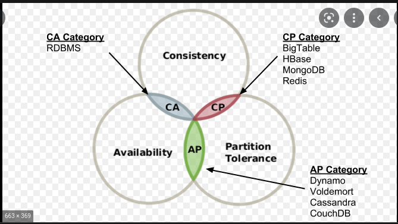

# Choosing the right NoSQL DB
Date: 2022-06-23

## Status
Accepted

## Context

No SQL Databases offer high flexibility in schema and scale. Hence NoSQL is a better choice over traditional SQL databases for the spotlight platform which is explained in this [ADR](./012.adr-operational-data-storage.md) 

NoSQL databases are classified into 4 types.

* Document stores
* Graph databases
* Key-value store 
* Wide column store

credits : https://www.researchgate.net/figure/CAP-theorem-with-databases-that-choose-CA-CP-and-AP_fig1_282519669

## Decision

- As there won't be too many writes, a document-based store would be a better choice. 
- the document data stores offer data partitioning, which would help as the platform expands toward different regions.
- Key-value store would be helpful in use cases of caches, where aggregate queries are not required.

## Reference

- https://www.bmc.com/blogs/cap-theorem/#:~:text=The%20CAP%20theorem%20is%20a,or%20availability%E2%80%94but%20not%20both
