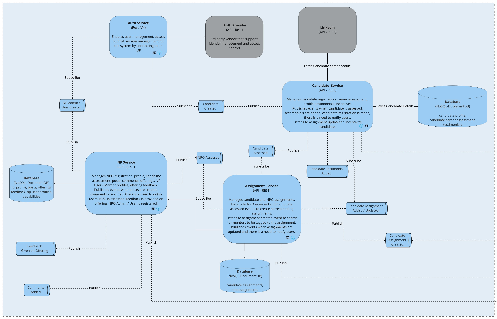

# Arch style for NP candidate quanta
2022-06-23

## Status
Accepted 

## Context
Np candidate quanta consists of the core services in our architecture

Spotlight platform is a greenfield project. It comes with ambiguities and risks.

### Alternatives

* Monolith
* Microservice

### PrOACT

| Factor      | Monolith | Microservice |
| ----------- | ----------- | ----------- |
| Cost(time+money)  | Low | High | 
| Maintenance | Low        | High | 
| Coupling | High | Low
| Scalability | Low        | High |
| Extensibility | Low | High

## Decision
* **Monolith** If there is a cost constraint. Building monolith is cost friendly and less maintainance overhead. Start with monolith and later migrate to microservice after we have a procduct market fit and system requires to scale.
**Microservice** If there is no cost constaint 

## References

[Monolith vs micorservices](https://www.geeksforgeeks.org/monolithic-vs-microservices-architecture/)