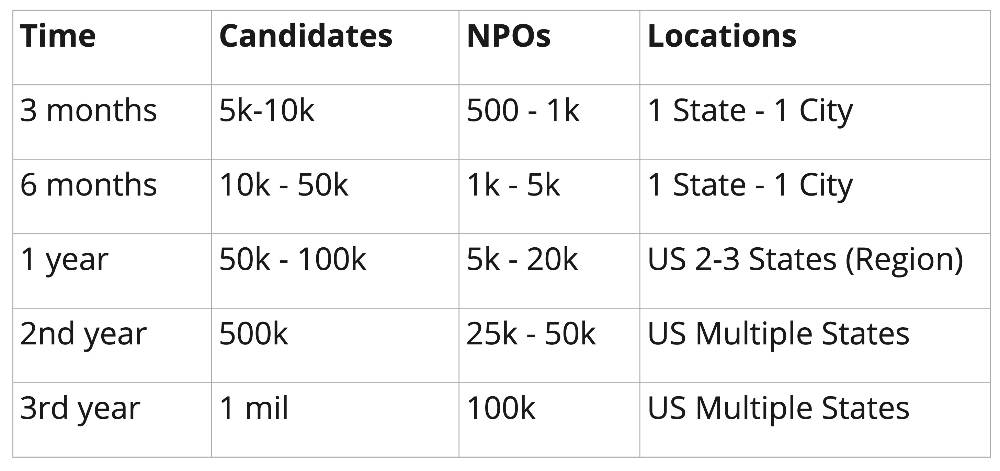

# Spotlight Platform

## Table of Contents
* [Glossary](#glossary)  
* [Prelude](#prelude)  
* [Requirement Analysis](#requirement-analysis)
* [User Experience](#user-experience)  
  * [Candidate Flow](#candidate-flow)
  * [Non Profit Screens](#non-profit-flow)
* [Assumptions](#assumptions)
* [Identifying Architectural Quanta](#identifying-architectural-quanta)
  * [Event Storming](#event-storming)

## Glossary
* NPO / NP - Both acronyms are used to refer to non-profit organizations.

## Prelude
There are about 1.6 million non-profit organizations [Source](https://independentsector.org/about/the-charitable-sector/) and more than 100 million underrepresented people [Source](https://www.governing.com/archive/gov-nonprofits.html) in the US. But the problem today is that these NPOs are decentralized and there is no support / framework for active collaboration. Also, lack of visibility of the NPOs creates a barrier of access to the underrepresented demographics. 

Let's imagine a use case - A candidate enrolled for a course in an institution in City A, away from his home city. He would need to travel to City A, find an affordable place to stay, search for places to get groceries and food, etc. Without a centralized system and collaboration between NPOs, the candidate may end up spending a lot more and may lose interest if it is not viable.

The numbers mentioned above are quite large and provide tremendous opportunities to build a platform and enable the collaboration.

Diversity Cyber Council has come forward with a vision to enhance inclusion and representation in the tech industry through training, mentoring, networking, and visibility programs.

### Goal of the platform
To establish a sustainable and diverse talent pipeline that extends career equity to underrepresented demographics by providing access to competent training programs that lead to direct employment opportunities.

## Requirement Analysis
1. *The Platform must establish a way to incentivize engagement such as sharing of resources, collaboration, networking, facilitating introductions, and partnerships*
   * NPOs or candidates can be rewarded with points for various activities they perform using the system. Google places is a good example which rewards with points on posting reviews, images, etc. on places. And an individual is entitled to certain benefits upon accumulating certain no. of points.                                         
   * The platform must be **configurable** to introduce or update new incentive rules to reward engagement.
2. *The Platform must categorize/tag nonprofit support services to match candidate needs identified in the onboarding assessment to include but not limited to Resume Writing Services, Interview Prep, Free Business Attire, Apprenticeship Program Registration, Training Program Registration, College & University Registration, Free Grocery & Meal Services, Discounted Rent & Housing Services, Daycare/Child Care Services, Mentorship/Career Advocate Services*
   * **Tagging** and **indexing** of resources based on services for faster searches.		
3. *End-Use Ease of Use is a hard requirement*
   * The underrepresented demographics may not be tech-savvy. So, **Usability** of the platform and the app becomes important.
4. *Tracking candidate progress is a hard requirement.*
   * Warrants **data integrity** in the system to accurately show candidate progress.
5. *Tracking engagement is a hard requirement*
6. *The Platform must provide a way to allow Non-Profits to publicize offerings to the platform that can provide some level of automatic matching for Candidate requests.*
   * Recommendations based on the candidate's profile, interests and activity in the system.
7. *The Platform allows offerings to contain rich text, links, and downloadable readable content such as PDFs, but no other downloads.*
   * Since the files are essential for any NGO to operate, they must be **reliably** stored and **recoverable** (in case of disaster).
8. *Each offering must support a certain list of properties (defined by the platform), such as name, organization description, website, unique identifier (assigned by the Administrators) and other identification information.*
9.  *The Platform must provide both operational reports (number of candidate matches / period, number of offerings / region, and so on) and analytical reports (projections of future desirable career paths, Offering gaps in a region based on demand, and so on) for use by Administrators.*
    * System should be **performant** to process reports quickly.
    * System should **reliably** store user activity and data coming from various services in the platform.
    * Big data store to train models for better predictions. Consider **OLAP solution** to perform analytics.
10. *Reminder to think critically about the nonprofit and candidate experience, anticipate these users needs while developing the use case and user stories. Consider what can offer these users maximum value to fulfill the intent of logging on the app.*
    *  Apply design thinking to understand user personas and their needs. Come up with a user experience that is intuitive.

## User experience

### Candidate Flow

### Few Non-Profit Screens

## Assumptions
#### Capacity planning

## Platform Roadmap
There are several factors which affect the success of any new business or green field project.
* Viability of the idea - Are there any buyers for the idea?
* Funding - Are there any investors for the idea? 
* Time - An idea may be viable but it may take a long time to develop. And an idea which is viable today may not be that attractive after certain period of time.

Also, _Why should the business invest to build a fortress when it is not sure if anyone would be staying in it or using it._

Shorter iterations to get market feedback and pivoting, if necessary, becomes important. So, the architecture should be in such a way that it can **evolve** with the growth in the business.

### MVP
The MVP is envisioned to bring out the unique value proposition of the platform and solve the key business problem / pain points. It should be sufficient for the business to get market feedback and pivot.

### Long Term

## Identifying Architectural Quanta
**Architecture quantum** - *An independently deployable artifact with high functional cohesion and synchronous connascence*

Quanta identification helps in defining different parts of the platform and the scope of architectural characteristics. We followed a mixture of event storming + actor-action approach to identify aggregates, components and quanta.

[Click here for more details on the exercise.](./architectural-quanta/quanta-identification.md)

### Services - Responsibilities and Architectural Characteristics
* [Matching Service](./architectural-quanta/matching-service.md)
* [Auth Service](./architectural-quanta/auth-service.md)
* [Notification Service](./architectural-quanta/notification-service.md)
* [Document Service](./architectural-quanta/document-service.md)
* [Reports Service](./architectural-quanta/reports-service.md)

### Quanta
* [Candidate - NPO Quanta](./quanta/candidate-npo.md)
* [Recommendations](./architectural-quanta/auth-service.md)
* [NPO Integrations](./quanta/npo-integration.md)
* [Chat](./architectural-quanta/document-service.md)
* [Support](./architectural-quanta/support-service.md)
* [Meetings](./architectural-quanta/meetings-service.md)

## Overall Architecture

### Logical View

### Component View

## Engineering Practices

* [Continous Integrations and Continous Deployment ](./engineering-practices/CI-CD.md)
* [Continous Delivery](./engineering-practices/Continous-Delivery.md)
* [Data compliance and Security](./engineering-practices/Data-compliance-security.md)
* [Twelve Factor app](./engineering-practices/twelve-factor.md)
* [Sidecar Pattern](./engineering-practices/sidecar-pattern.md)
* [Monitoring and Observability](./engineering-practices/Monitoring.md)
* [Feature Toggles](./engineering-practices/Feature-Toggles.md)