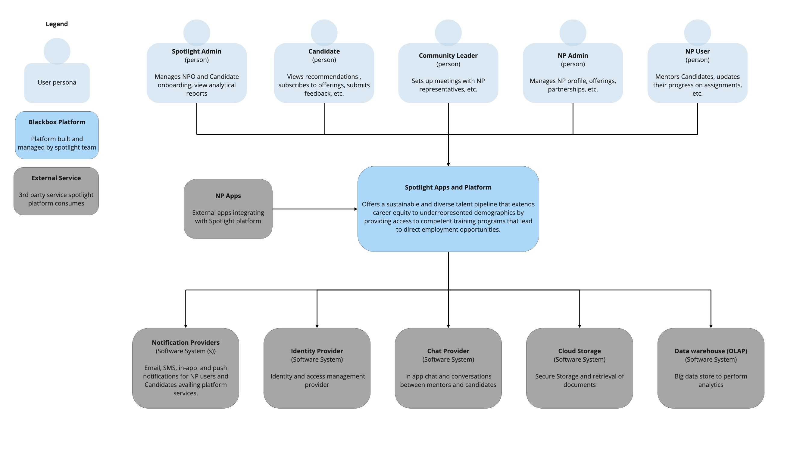
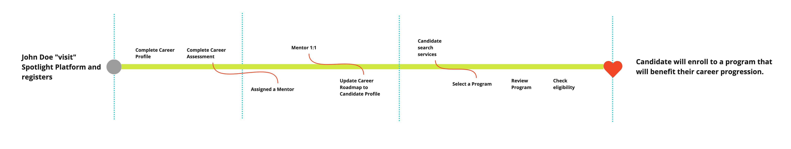
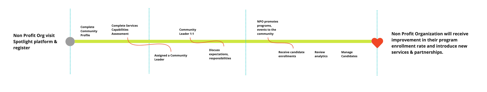
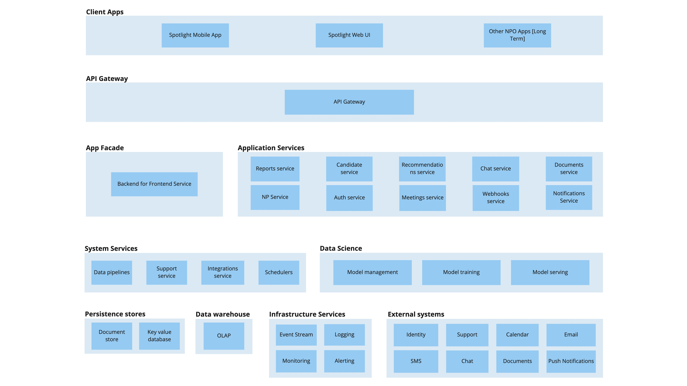
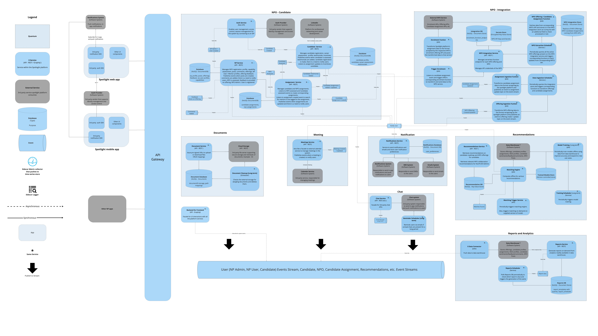

# Spotlight Platform

## Final Presentation

https://prezi.com/v/view/QLsX6RaSORYOurrrfhnL/

## Table of Contents
  * [About Team PegasuZ](#about-the-team)
  * [Glossary](#glossary)
  * [Prelude](#prelude)
  * [Non-functional requirements](#non-functional-requirements)
  * [Overall Platform Context](#context-diagram)
  * [User Experience](#user-experience)  
    * [Candidate Golden Path](#candidate-flow)
    * [NPO Golden Path](#non-profit-flow)
  * [Assumptions](#assumptions)
  * [User Roles](#user-roles)
  * [Identifying Architectural Quanta](#identifying-architectural-quanta)
    * [Quanta](#quanta)
    * [Other Services](#other-services)
  * [Overall Architecture](#overall-architecture)
    * [Logical View](#logical-view)
    * [Component View](#component-view)
  * [Platform Road map](#platform-roadmap)
  * [Call Flow diagrams](#call-flow-diagrams)
  * [Engineering Practices](#engineering-practices)
  * [Resources](#resources)

## About Team PegasuZ

We are a passionate group of software engineers & product managers from an innovation as a service organization [Zemoso](https://www.zemosolabs.com/).

* [Pranava Shashank P](https://www.linkedin.com/in/pranavashashank/) 
* [Naveen Chevuru](https://www.linkedin.com/in/naveenchevuru/)
* [Ashish Kumar Das](https://www.linkedin.com/in/das-ashish/) 
* [Sai Venkatesh Vemuri](https://www.linkedin.com/in/saivenkateshvemuri/) 
* [Vasanth Kumar](https://www.linkedin.com/in/vasanth-kumar-22b9a4109/) 

The name PegasuZ is a combination of the words "Pegasus" (which reflects progression) and "Zemoso" (since the team members are from Zemoso).

So, `PegasuZ = [Pegasu]s + [Z]emoso`

## Glossary
* NPO / NP - Both acronyms are used to refer to non-profit organizations.
* NFR - Non-functional requirement
* MVP - Minimum Viable Product
* PII - Personal Identifiable Information
* UI - User Interface
* UX - User Experience
* IA - [Information Architecture](https://en.wikipedia.org/wiki/Information_architecture)

## Prelude
There are about 1.6 million non-profit organizations [[Source](https://independentsector.org/about/the-charitable-sector/)] and more than 100 million underrepresented people [[Source](https://www.governing.com/archive/gov-nonprofits.html)] in the US. But the problem today is that these NPOs are decentralized and there is no support / framework for active collaboration. Also, lack of visibility of the NPOs creates a barrier of access to the underrepresented demographics. 

Let's imagine a use case - A candidate plans to enrol for a course in an institution in **City A**, away from his home city. He would need to travel to **City A**, find an affordable place to stay, search for places to get groceries and food, etc. Also, after completion of the course, he would need to prepare for interviews and get placed. Without a centralized system and collaboration between NPOs, the candidate may end up spending a lot more than what he can afford and his career path / shift may not be feasible.

The number of NPOs and underrepresented people mentioned above are quite large and provide tremendous opportunities to build a platform to enable the collaboration.

Diversity Cyber Council has come forward with a vision to enhance inclusion and representation in the tech industry through training, mentoring, networking, and visibility programs.

### Goal of the platform
To establish a sustainable and diverse talent pipeline that extends career equity to underrepresented demographics by providing access to competent training programs that lead to direct employment opportunities.

## Non-Functional Requirements

After the **[detailed analysis of business requirements](./other-artifacts/Requirement-analysis.md)**, the team has come up with the below NFRs for the platform

* Workflow
* Evolutionary
* Feasibility
* Scalability
* Usability
* Availability
* Data Integrity

Since the proposal is a platform, the platform could be composed of several architectural quanta, each with its own architectural style. So, we are not picking a style yet.

## Overall Platform Context

[For better navigation on the content, use this miro frame](https://miro.com/app/board/uXjVOv-nlBo=/?moveToWidget=3458764528112682339&cot=14)

## User experience
The team went through a design thinking exercise to understand the Candidate and NP user profiles, and empathize their needs and pain points. The following golden paths were considered:

[Design artifacts](./design/design-artifacts.md)

### Candidate Golden Path

https://www.loom.com/share/7d1540ecfed24c0191f7087d7a747260

### Non-Profit Golden Path

https://www.loom.com/share/2f3be1ded8bd438e958ffd8cc9595e83

## Assumptions
### Capacity planning
Going by the no. of NPOs and under represented demographics mentioned in [Prelude](#prelude), we decided to design the system for the following capacity:

| Time        | Candidates  | NPOs       | Locations          |
| ----------- | ----------- | ---------- | ------------------ |
| 3 months    | 5k-10k      | 500-1k     |  1 State - 1 City  |
| 6 months    | 10k - 50k   | 1k - 5k    |  1 State - 1 City  |
| 1 year      | 50k - 100k  | 5k - 20k   |  US 2-3 States (Region)  |
| 2 years     | ~ 500k      | 25k - 50k  |  US Multiple States (Regions)  |
| 3 years     | ~1 mil      | ~ 100k     |  US Multiple States (Regions)  |

### Availability
Since Spotlight is not a public safety or mission critical (dealing with lives or money directly) platform, 5 nines (99.999% - 5.2 minutes of downtime per year) is unreasonable and 4 nines would also be an overkill (99.99% - 52.5 minutes of downtime per year). 

So, we decided to design the system for an availability between 3 nines (for quanta which do not have synchronous dependencies, like reporting and analytics) and 4 nines (for quanta which have synchronous dependencies, like notifications).

[Reference](https://aws.amazon.com/blogs/publicsector/achieving-five-nines-cloud-justice-public-safety/#:~:text=The%20accepted%20availability%20standard%20for,system%20must%20work%20seamlessly%20together.)

## User Roles
* PLATFORM_ADMIN (associated with the Spotlight Platform)
* COMMUNITY_LEADER (associated with the Spotlight Platform)
* NP_ADMIN (associated with the NPO)
* NP_USER (associated with the NPO) - Can be NPO offering's mentor 
* CANDIDATE

## Identifying Architectural Quanta
**Architecture quantum** - *An independently deployable artifact with high functional cohesion and synchronous connascence*

Quanta identification helps in defining different parts of the platform and the scope of architectural characteristics. We followed a mixture of event storming + actor-action approach to identify aggregates, components and quanta.

[Click here for more details on the exercise.](./quanta/quanta-identification.md)

### Quanta
* [NPO - Candidate](./quanta/npo-candidate.md)
* [Reports](./quanta/reports.md)
* [Notification](./quanta/notification.md)
* [Recommendations](./quanta/recommendation.md)
* [Chat](./quanta/chat.md)
* [Meetings](./quanta/meetings.md)
* [Document](./quanta/document.md)
* [NPO Integrations](./quanta/npo-integration.md)

### Other Services
* [Infrastructure Services](./other-services/infrastructure-services.md)
* [Support](./other-services/support-service.md)
* [BFF](./other-services/bff-service.md)

## Overall Architecture

### Logical View

[View as pdf](./diagrams/logical-arch/spotlight-logical-architecture.pdf)

### Physical View

[View as pdf](./diagrams/component/spotlight-component-diagram.pdf)

[For better navigation on the content, use this miro frame](https://miro.com/app/board/uXjVOv-nlBo=/?moveToWidget=3458764528112682338&cot=14)

## Platform Road map

### MVP
The MVP is envisioned to bring out the unique value proposition of the platform and solve the key business problem / pain points. It should be sufficient for the business to get market feedback and pivot, if needed.

Areas to be addressed (In the order of priority):

1. NPO - Candidate quantum (Modular Monolith)
2. Base platform infrastructure
   * CI / CD pipelines with continuous delivery.
   * Logging
   * Monitoring
3. BFF Service
4. Document quantum
5. Chat quantum
6. Notification quantum
7. Meetings quantum
8. Reports quantum - Without Analytics
9. Recommendations quantum - Simple, without model training

### Long Term
Areas to be addressed:
* NPO - Candidate quantum (migrate to Microservices + Event Driven)
* Reports quantum - Advanced predictive analytics
* Recommendations quantum - with model training
* NPO Integrations
* Support Service

## Engineering Practices

* [Continuous Integrations and Continuous Deployment ](./engineering-practices/CI-CD.md)
* [Continuous Delivery](./engineering-practices/Continous-Delivery.md)
* [Data compliance and Security](./engineering-practices/Data-compliance-security.md)
* [Twelve Factor app](./engineering-practices/twelve-factor.md)
* [Sidecar Pattern](./engineering-practices/sidecar-pattern.md)
* [Monitoring and Observability](./engineering-practices/Monitoring.md)
* [Feature Toggles](./engineering-practices/Feature-Toggles.md)

## Resources
* [Design Thinking](https://miro.com/app/board/uXjVOv-nLZE=/)
* [Arch Katas Artifacts](https://miro.com/app/board/uXjVOv-nlBo=/)
