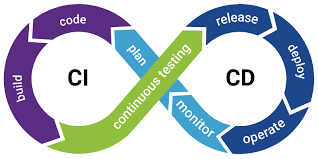

# CICD practices

Continuous integration and continuous delivery must be an integral part of engineering culture. 

 
credits : src : https://www.synopsys.com/glossary/what-is-cicd.html

## Continuous Integration Practices

* Linting and format checks for code consistency.
* Code should be built ensuring no static and compile-time errors.
* Unit tested to ensure there are no functional bugs.
* Code quality checks to ensure bad code stays away from the main branch.

## Continuous Deployment Practices

* Code ships automatically when merged to the main branch

## References
https://www.atlassian.com/continuous-delivery/principles/continuous-integration-vs-delivery-vs-deployment