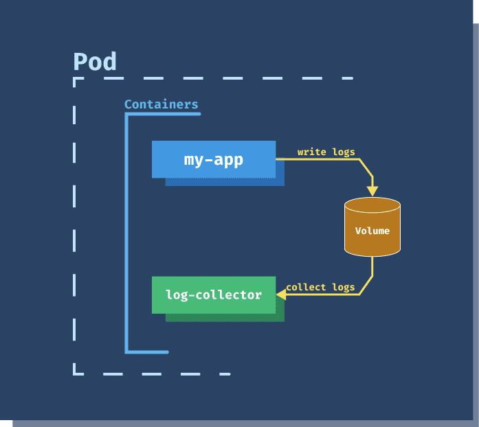

#Sidecar Pattern

## Context
Applications and services often require related functionality, such as monitoring, logging, etc. These peripheral tasks can be implemented as separate components or services. This means they are not well isolated, and an outage in one of these components can affect other components or the entire application. Also, they usually need to be implemented using the same language as the parent application. As a result, the component and the application have close interdependence on each other.

## Sidecar Pattern

* The sidecar is a component of the application which is attached to a parent application and provides supporting features.
* The sidecar also shares the same lifecycle as the parent application, being created and retired alongside the parent. 

 
credits: https://dev.to/peterj/sidecar-container-pattern-314

## Usecases

* Your primary application uses a heterogeneous set of languages and frameworks. 
* A component is owned by a remote team or a different organization.
* A component or feature must be co-located on the same host as the application

##References
https://www.oreilly.com/library/view/designing-distributed-systems/9781491983638/ch02.html
https://netflixtechblog.com/how-netflix-uses-ebpf-flow-logs-at-scale-for-network-insight-e3ea997dca96