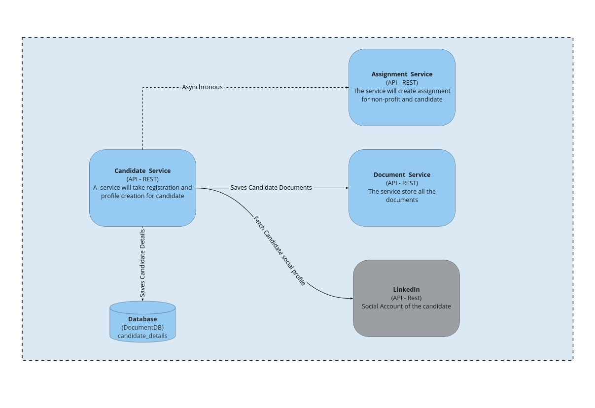

## Candidate Service

### Responsibilities

1. Register the Candidate to the platform
2. Profile Creation/Completion of the Candidate
3. Uploading the road map of the candidate
4. Program enrollment of the candidate
5. Pull data from LinkedIn

### Driving Architectural Characteristics

#### Top 3

- **Scalability**
  As this is a fundamental service, and as the number of users grows, the service will see more traffic.
- **Availability**
  Because the service is used to collect information regarding the candidate, it must be highly accessible.
- **Data Integrity**
  Because the service is in charge of keeping the information relevant to the candidates, Data Integrity will assure the quality and completeness of the data.

### Architectural Style Preferred

Microservices

### Relevant ADRs
