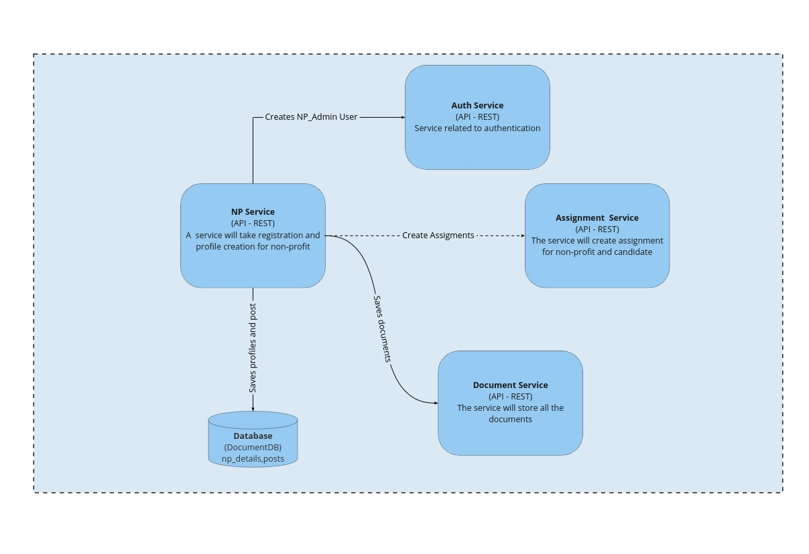
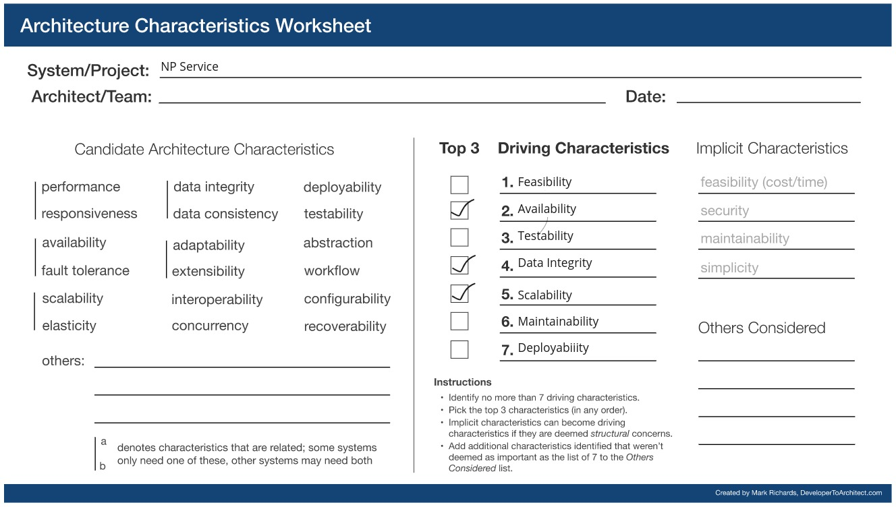

## NP(Non-profit) Service

### Responsibilities

1. Register a Non-Profit organization to the platform
2. Profile Creation/Completion of the Non-Profit organization
3. Non-Profit program management
4. Managing partnerships with other Non-Profit organizations
5. Allow the Non-profit organization to put the post.
6. Allow to comment on the post

### Driving Architectural Characteristics

#### Top 3

##### 

- **Scalability**
  The service is a fundamental function, and as the number of organizations grows, the service will see more traffic.
- **Availability**
  Because the service is used to register new non-profit organizations and establish a listing of their services, it must be highly accessible.
- Data Integrity
  Because the service is in charge of keeping the information relevant to the organization, Data Integrity will assure the quality and completeness of the data.

### Architectural Style Preferred

Microservices

### Relevant ADRs
