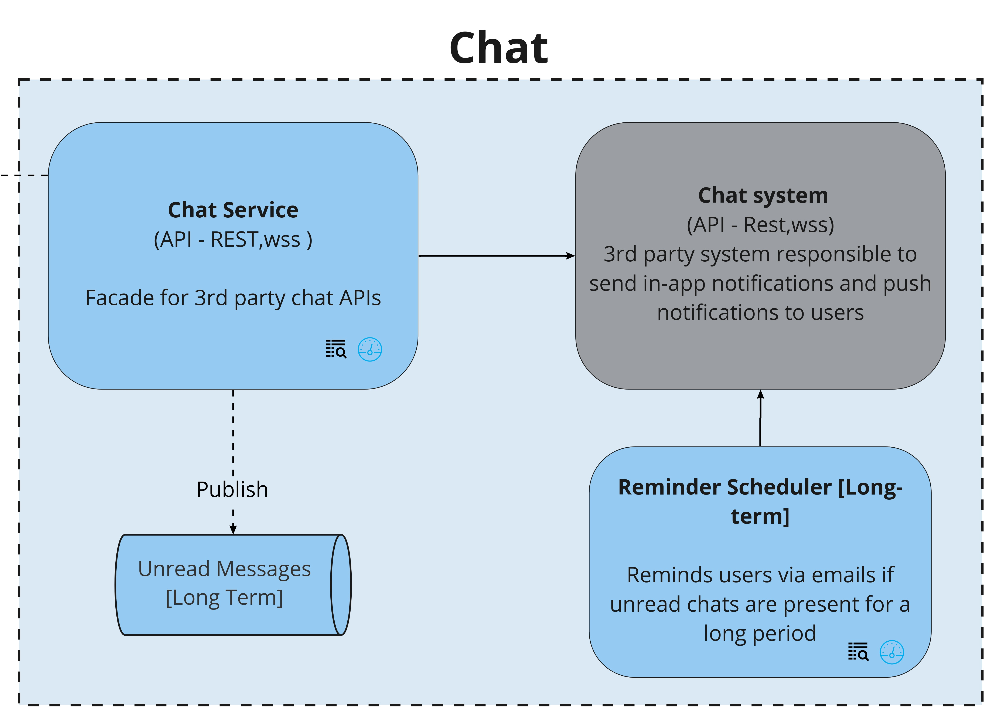

## Chat

### Context
Having in-app chat support on the platform is a great way to engage with the community. Also, a candidate doesn't have to leave the app to engage with the mentors (say over email). 

### Responsibilities
1. Initiate a new conversation with users.
2. View and reply to messages.
3. Support read receipts and last active status.
4. Integrate with 3rd party chat service for the functionalities.
4. Remind users through an email if a chat remains unread. 

### Driving Architectural Characteristics
#### Top 3
##### Driving Architectural Characteristics
1. Responsiveness
   The messages have to be sent and received with minimal latency
2. Data integrity
   Correctness of messages and intended recipients.
3. Feasibility (cost + time)

##### Characteristics that we do not need as we offloaded to 3rd party vendors
1. Security
   Security for messages during storage and transit.
2. Scalability and Availability  
    Service highly depends on third party service for scale and uptime

### Architectural Style Preferred
Microservices

### Tradeoffs - Mitigation Strategies
* Building a highly responsive chat service within the platform is a challenge and time consuming. Also, it is not the core value proposition of the 
  * Go for an external chat provider
