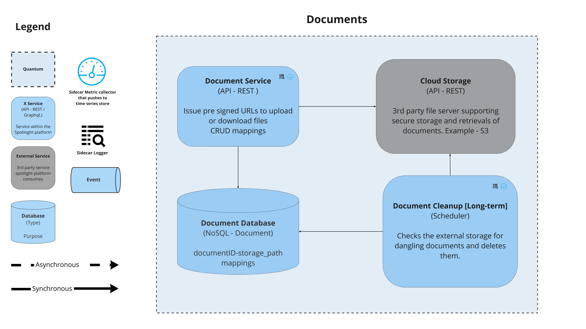

## Document Service

This service stores and retrieves files. The files could be images (avatars, NPO favicons, etc.) or documents (candidate resumes, NPO offering details, reports - PDF / Spreadsheet, etc.), which are not expected to be large.

### Responsibilities
1. Document management - create, read, delete

### Driving Architectural Characteristics
#### Top 3
* **Recoverability** - In case of disasters, the service is expected to lose storage. Regular backups need to be taken.
* **Responsiveness** - Respond to document requests as quickly as possible. Probably, cache the frequently used files using CDNs.
* **Scalability** - Since this is integral to the business to store resumes, NPO offerings, etc., traffic on the service is expected to quickly rise with the increase in no. of NPOs and candidates.

#### Other Driving Characteristics
* **Availability** - Since documents, such as resumes and NPO offerings, form the core of the business, it is expected that documents service The service should be highly available.

### Architectural Style Preferred
Microservices

### Relevant ADRs
* [External Document Storage](../ADRs/external-document-storage.md)
* [Data route to storage](../ADRs/data-route-to-storage.md)
