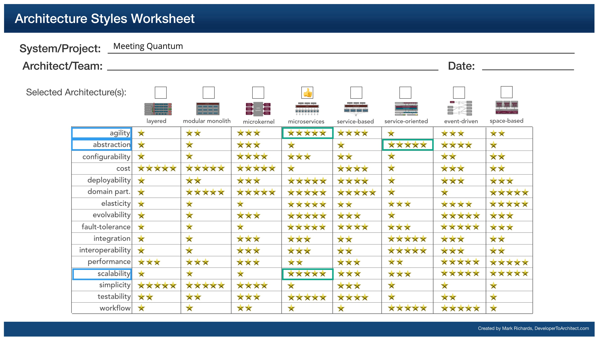
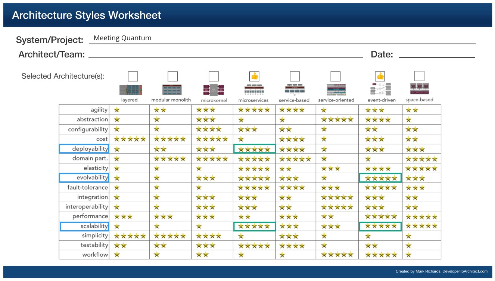

## Meetings

Engagements are a key part of the Spotlight platform and meetings are a way to engage with the community. However, Building a reliable calendar service within the platform would take time and is not the core value proposition. (See [ADR](../ADRs/adr-build-vs-buy.md)). Recommended to use a 3rd party calendar service.

### Responsibilities

1. Let NPOs create & manage events.
2. Maintain RSVP - invited, accepted, rejected, Maybe.
3. Send notifications to respective participants regarding any update to event.
4. Collect feedback, post an event.
5. Archive event post completion and disable further updates.

### Driving Architectural Characteristics

#### Top 3

* **Abstraction** - The meetings service acts like a facade to the 3rd party calendar service.

- **Scalability**: Should support the increase in no. of NPOs and Candidates adopting to the platform.

* **Extensibility** - Should support addition of platform specific features not provided by the 3rd party meetings provider.

##### Characteristics that we do not need as we offloaded to 3rd party vendors
- **Feasibility** - Meetings is the core value proposition of the platform to enable better engagement between the user, especially Candidates and Mentors. So, building it as part of the MVP is inevitable and feasibility becomes important. One can consider going for a 3rd party chat provider, rather than building in-house.
- **Recoverability** - Service must recover from any failures fast and no loss of data.
- **Availability** - The service must be available at all times since other services are dependent on it.

### Architectural Style Preferred

Microservices

### Relevant ADRs

- [Build vs buy](../ADRs/adr-build-vs-buy.md)