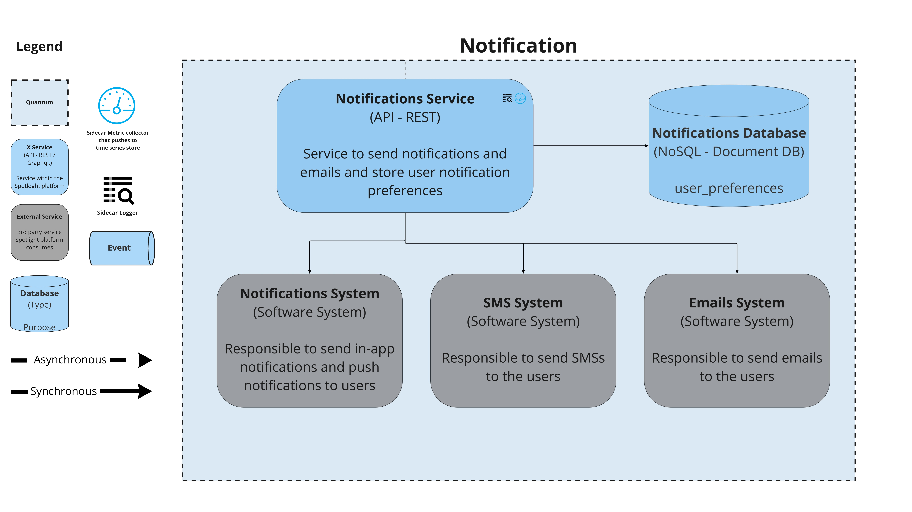
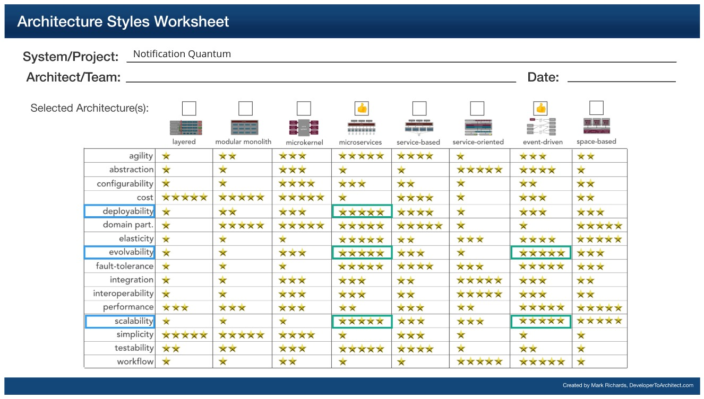

## Notification

### Responsibilities
1. Send in-app and push notifications to users, this will increase the usability of the app.
2. Saves users' preferences about the type and frequency of notifications they would like to be subscribed to.
3. Notify users via emails.
4. Integrate with 3rd party notification and email providers.
4. Enable users to send and notify user(s) through emails and notifications

### Driving Architectural Characteristics

#### Top 3
##### Driving Architectural Characteristics
1. Concurrency
   The system needs to be concurrent enough to notify users and user groups about different subjects at the same time.
2. Data integrity
   Correctness or emails and notifications is highly important as they would be misleading otherwise.
3. Availability
   Service should be highly available so that users do not miss anything.

##### Characteristics that we do not need as we offloaded to 3rd party vendors
1. Security
   Security around emailing service will be the responsibility of the emailing vendor.
2. Scalability and Availability  
   The notification provider should be highly scalable and available at the same time

### Architectural Style Preferred
Microservices

### Relevant ADRs

