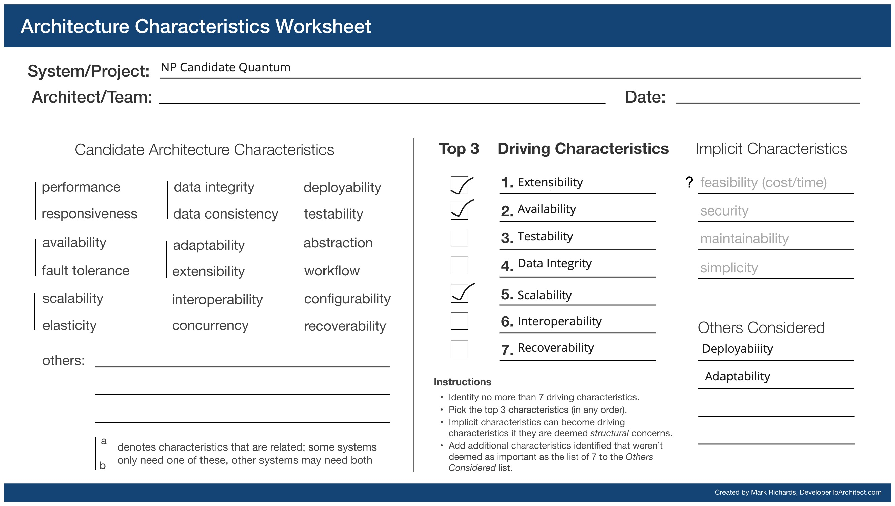

## Candidate-NPO Quantum

### Components and responsibilities
* NP Service:
  * Manages NPO registration, profile, capability assessment, posts, comments, offerings, NP User / Mentor profiles, partnerships with other NPOs, offering feedback.
  * Publishes events when posts are created, comments are added, there is a need to notify users, NPO is assessed, feedback is provided on offering, NPO Admin / User is registered.
* Candidate service
  * Manages candidate registration, career assessment,  profile, testimonials, incentives
  * Publishes events when candidate is assessed, testimonials are added, candidate registration is made, there is a need to notify users.
  * Listens to assignment updates to incentivize candidate.
* Assignment Service
  * Manages candidate and NPO assignments.
  * Listens to NPO assessed and Candidate assessed events to create corresponding assignments.
  * Listens to assignment created event to search for mentors to be tagged to the assignment.
  * Publishes events when assignments are updated and there is a need to notify users,
* [Auth Service (refer this page for more details)](../other-services/auth-service.md)
  * Enables user management, access control, session management for the system by connecting to an IDP

### Driving Architectural Characteristics

#### Top 3
**Scalability** - As these are fundamental services in the platform to capture operational data, and as the number of users and NPOs grow,the service will see more traffic
**Availability** - These services need to be available in different regions across the US to support the users.
**Data Integrity** - Because the service is in charge of keeping the information relevant to the candidates and NPOs, Data Integrity will assure the quality and completeness of the data.

#### Other Architectural Characteristics

**Recoverability**
**Feasibility**
**Testability**

### Architectural Style
Hybrid - Event Driven and Microservices

### Trade-offs - Mitigation Strategies
* Due to event driven system, the data is not always available immediately. It is eventually consistent.
* Event Driven microservices is a costly architecture both in terms of time and cost.
  * Mitigation - Front load the effort to setup infrastructure (CI / CD, monitoring, logging, etc) to make the architecture viable in longer term.
  * Use external services to offload functionality which is not the core value proposition of the platform (like Auth).