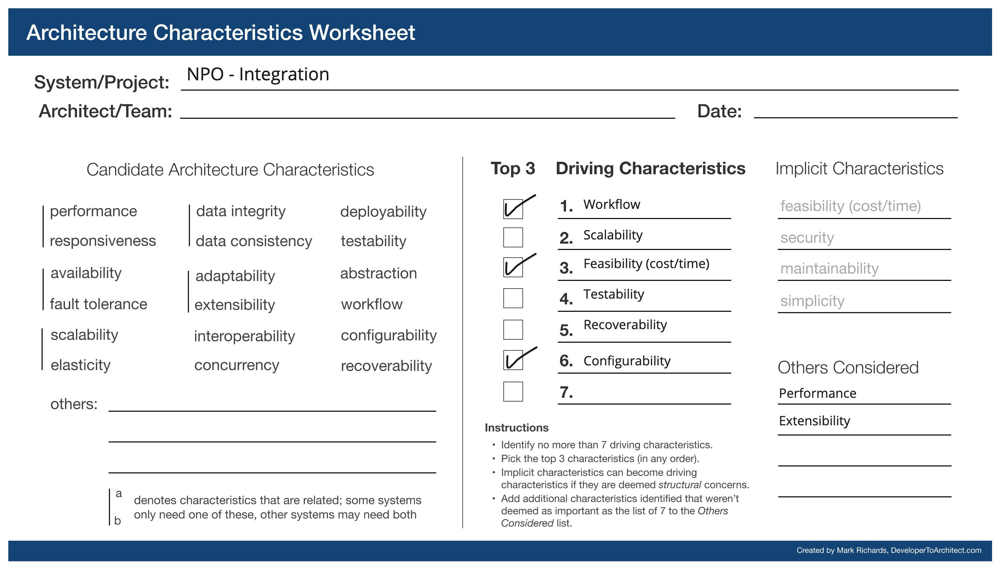

## NPO Integration [Long Term]

The spotlight platform's requirements state that *Tracking candidate progress* and *End-Use Ease of Use* are hard requirements. Without an automated system in place, NP Users (admins, mentors, tutors, etc.) would have to manually update candidate's progress on assignments by logging into the spotlight app, which may leave room for error or a gap in updating candidate's progress. Similarly, some offerings may need manual interventions before accepting candidate enrollments. This is unavoidable if the NPOs do not have a system or an API (outside of the Spotlight platform) of their own to manage their offerings and candidates. 

What if they do have such a developed system? There are two ways to integrate such systems:
1. The NPO builds a service to **push** data to a reliable stream provided by the Spotlight platform. 
   * This is straight forward and can be solved with services mentioned in the [NPO-Candidate quantum](npo-candidate.md)
2. Or Spotlight platform pulls the information from the NPO's API
   * This requires a sophisticated system which can be built in the longer term.

This document talks about the second use case.

### Requirements
Some of the requirements for the NPO integration:
* NPOs should be able to provide their API details (endpoints, credentials, etc.) to the Spotlight platform at the time of NPO assessment.
* Have independent functions to correctly transform the data to / from the NPO's API and the Spotlight platform.
* Should be able to introduce new NPO integrations without affecting the existing ones.
* The platform should be able to reliably transfer the data from the NPO's API to the Spotlight platform. 

### Components and Responsibilities
* NPO Integration Service:
    * Manages serverless function endpoint for each NPO offering and NPO
    * Manages API credentials of the NPO
* Trigger Enrollment (Job):
  * Listens to candidate assignment event and triggers NPO's corresponding enrolment function to transform and send data to the NPO service.
* Enrolment Function (Job):
  * Transforms Spotlight platform's assignment data to the format accepted by the respective NPO's enrolment offering API
  * Posts the above transformed data to that service
* NPO Offering / Candidate Assignment Extraction Function (Job):
  * Fetches data from corresponding NPO's API and stores it in the NPO integration store as is (may be with an additional field to check processed or not)
* NPO Extraction Scheduler)
  * Periodically queries all the active NPO offerings present on the NPO Integration service and triggers corresponding functions to fetch updates from corresponding NPO's API.
* Data Ingestion Scheduler
  * Periodically queries the integration store and triggers corresponding functions to transform offerings and candidate assignments.
* Assignment Ingestion Function (Job)
  * Transforms candidate assignment data to the format recognized by the spotlight platform and publishes an event to assignment update topic on the event stream.
* Offering Ingestion Function (Job)
  * Transforms NPO offering data to the format recognized by the spotlight platform and publishes an event to offering create / update topic on the event stream.

### Driving Architectural Characteristics

#### Top 3

* **Workflow**: Workflow is core to the NPO integration quantum to enable reliable ingest into spotlight platform and post data to the NPO's API.
* **Configurability**: Integration of the platform with a new NPO should not warrant a redeployment of the entire quantum. 
* **Feasibility**: The architecture should support quick integration with a new NPO

#### Other Driving Characteristics
* **Scalability**: Should support the increase in no. of NPOs wanting to integrate with the platform.
* **Testability**: Since this system needs to be highly configurable, supporting framework should be bug-free.

### Architectural Style Preferred
* *Event driven* for enabling workflow in data ingestion into the spotlight platform and pushing data to NPO APIs
* *Microkernal* for introducing new NPO integrations without affecting the existing ones.

### Tradeoffs - Mitigation Strategies
* Data consistency and integrity - Since the design is pulling data from NPO's API periodically (asynchronously), the data in both systems is not guaranteed to be consistent. 
  * Mitigation - Data can be made eventually consistent, based on the frequency of the scheduler, by using a reliable streaming framework.
* Testing an event driven system is tough.
  * Mitigation - The good news is that the challenges are well-known. Aggregated logging and distributed tracing across the system can be used to make it easier for the testers.