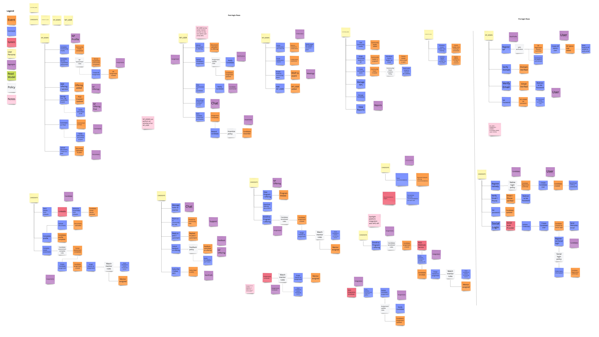
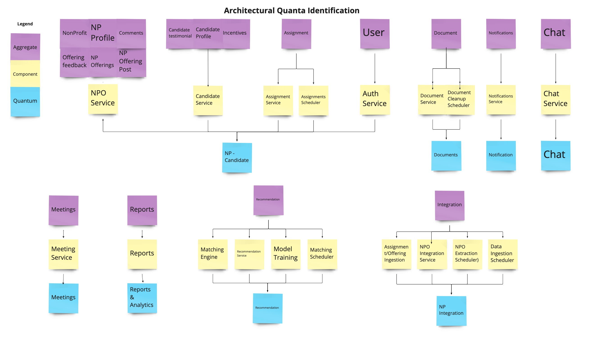

## Quanta Identification

The team collaboratively performed an event storming + actor action exercise to identify the aggregates.

[For better navigation on the content, use this miro frame](https://miro.com/app/board/uXjVOv-nlBo=/?moveToWidget=3458764528112831067&cot=14)

The aggregates were then grouped to identify services. Services with synchronous dependencies were identified to identify quanta.

### Quanta - Services

* NPO-Candidate
  * NPO Service
  * Candidate Service
  * Assignment Service
  * Assignment Scheduler
  * Auth Service
* Chat
  * Chat Service
* Notification 
  * Notification service
  * Email Service
  * 3rd Party Notification systems (for push and in-app notifications)
  * SMS 
* Meeting
* NPO-Integration
* Recommendation
* Documents
* Chat