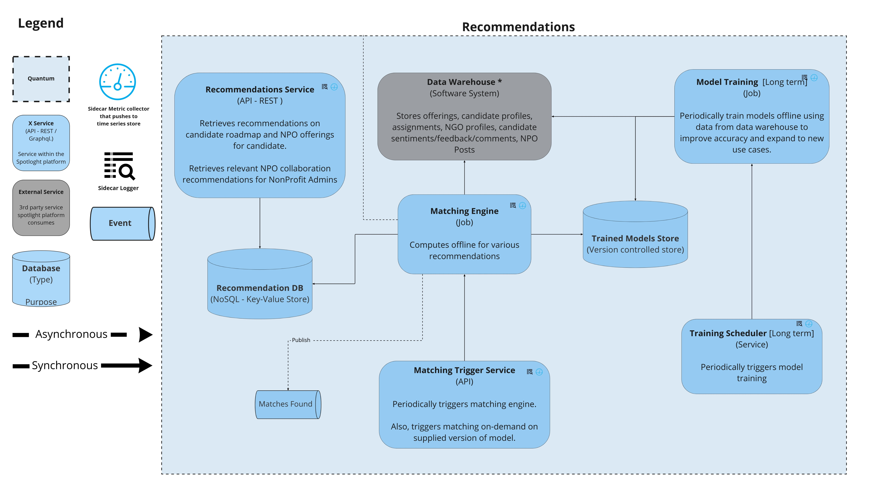
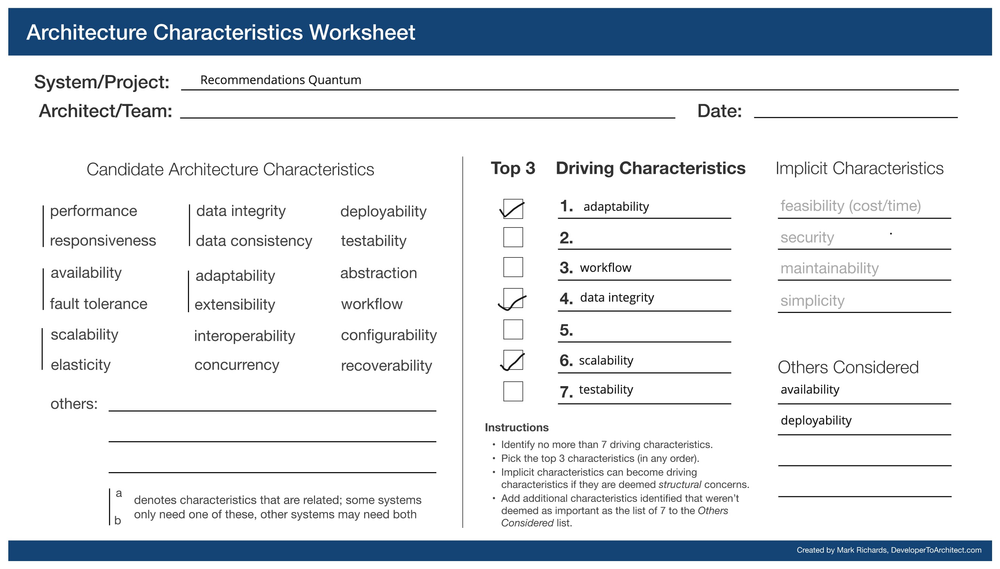
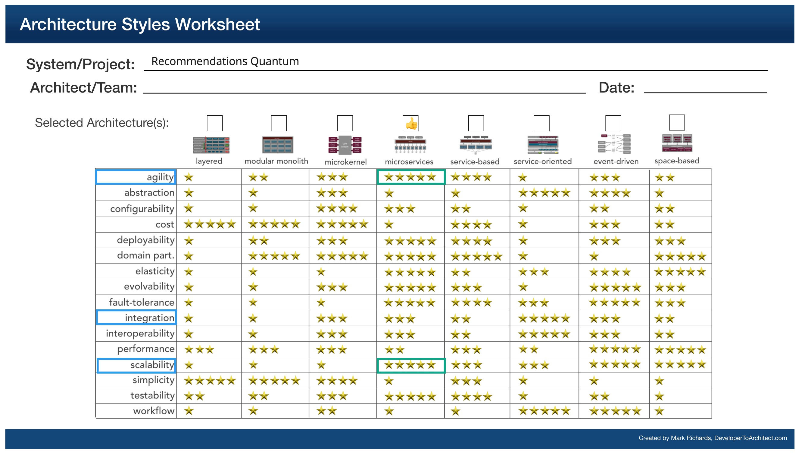

## Recommendations Quantum
Intelligently predicting and providing relevant recommendations regarding NPO offerings to the candidate adds value and fulfills the intent of the candidate of logging on the app. And, the matching can only become better over time with model training with more data captured by the platform. 

### Responsibilities
1. Recommends communities and NPO's to the candidates based on offerings and testimonials.
2. Recommends programs that candidates can enroll into
3. The service learns based on the feedback of previous recommendations and continues to improve as the system grows.

### Services
* Recommendations Service
* Model Training
* Training Scheduler
* Matching Trigger Service
* Matching Engine

### Driving Architectural Characteristics

#### Top 3
1. Adaptability - The system continues to adapt to growing requirements and varieties of users/communities it onboard.
2. Data integrity - The accuracy of matches is really crucial in increasing the user engagement and value proposition of the platform
3. Scalability - Scale the matching algorithm and workflow to ever-growing platform users.

#### Other Driving Characteristics
* Workflow
* Testability

### Architectural Style Preferred

Microservices

### Relevant ADRs

- [Build vs buy](../ADRs/003.adr-build-vs-buy.md)