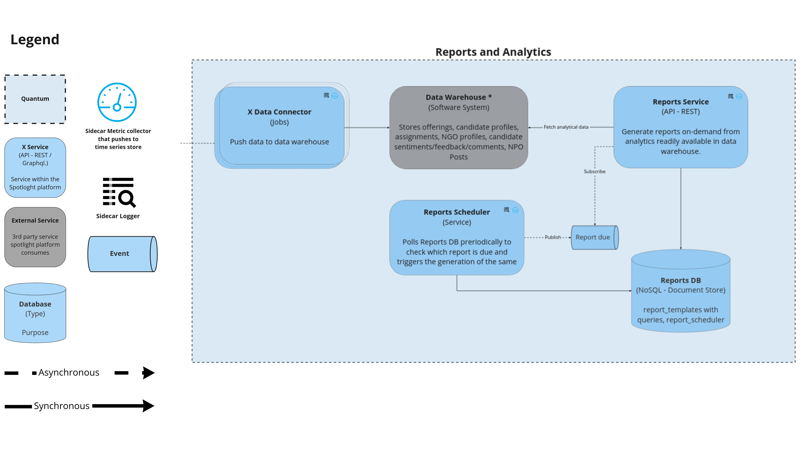
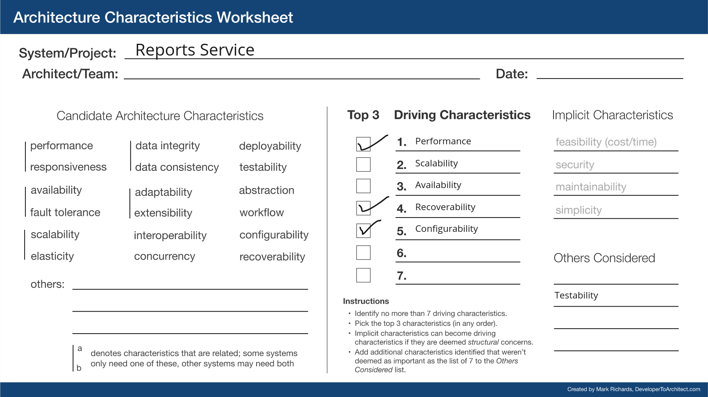
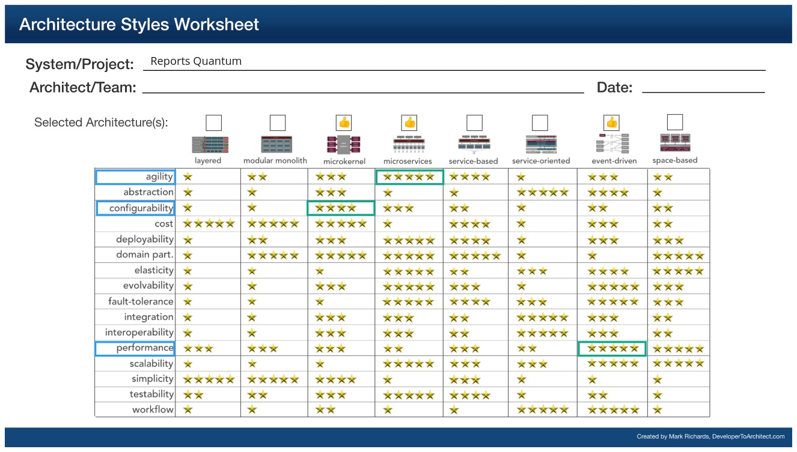

## Reports Service

This service enables users to generate various reports from analytics readily available in data warehouse

### Responsibilities

1. Let users generate and download reports on demand in requisite formats - PDF, CSV etc.
2. Scheduler to send reports - EOD, Weekly, Monthly etc.
3. Provide most commonly used reports by default
4. Enable the creation of custom reports (using custom query language)

### Driving Architectural Characteristics

#### Top 3

- **Performance** - Since reports can be fetched for varying time periods, the amount of data to be processed might be high - necessary optimizations must be done to ensure decent performance.
- **Recoverability** - Service must recover from any failures fast and with minimal loss of data.
- **Configurability** - Users can create and configure the way reports need to be generated.

### Architectural Style Preferred

Hybrid - Event-driven (for processing periodic reports) + Microservices

### Relevant ADRs

NA
